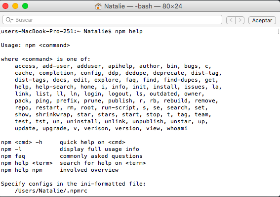
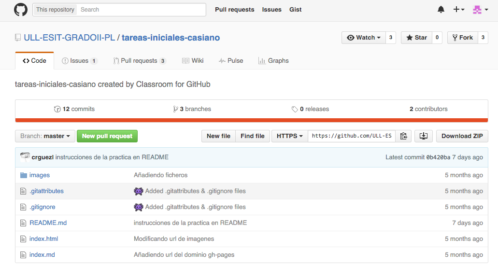
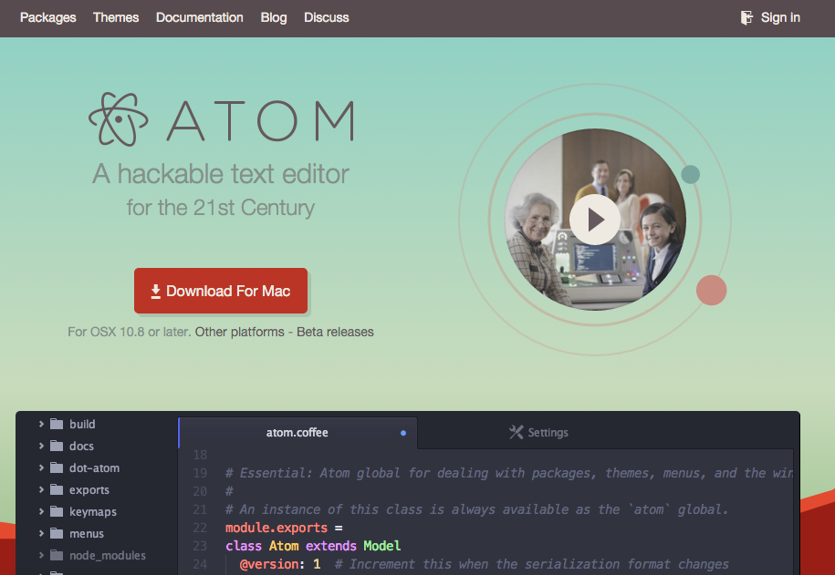

Tutorial tareas iniciales
=========================

### Explicaremos las herramientas utilizadas en esta tareas

  * #### Nodej.js

  Node.js es un entorno de programación en la capa del servidor basado en el lenguaje de programación Javascript

  Para instalar Node.js solo debemos acceder a la página de [**Node.Js**](https://nodejs.org/en/), descargar el archivo, ejecutarlo y seguir las instrucciones del instalador.

  

  

  * #### Express

  Express es una infraestructura de aplicaciones web Node.js mínima y flexible que proporciona un conjunto sólido de características para las aplicaciones web y móviles.

  La instalación de Express es aún más sencilla, solo debemos poner el siguiente comando en nuestra terminal:

  `$ npm install express --save`

  * #### Gchait

  Git es un control de versiones basado en instantáneas. Para usar GitHub debemos instalar antes git, pues necesitamos sus comandos. Para hacer esto solo debemos poner el comando:

  `$ apt-get install git`

  * #### GitHub

  GitHub es una plataforma de desarrollo colaborativo. Usa el sistema de control de versiones git, con el que podemos tener las distintas versiones de nuestro proyecto almacenadas.

  Tras aceptar la asignación tendremos acceso al repositorio [**tareas-iniciales-casiano**](https://github.com/ULL-ESIT-GRADOII-PL/tareas-iniciales-casiano). Después de aceptar la asignación debemos hacer un **fork**, con el creamos una copia del proyecto en nuestra cuenta de GitHub.

  

  Después de hacer esto, necesitamos hacer un **clone** para trabajar con el proyecto, esto lo hacemos con el comando:

  `git clone URL`

  Cuando hayamos hecho el clone podremos trabajar con el repositorio, añadiendo todos los cambios que queramos. Para guardar los cambios usaremos 3 comandos:

  `git add .` Añade los cambios al control de versiones  
  `git commit -m "Mensaje"` Confirma los cambios añadidos previamente con el mensaje especificado  
  `git push -u origin rama` Para empujar los cambios en el repositorio que tenemos en github  

  * #### Atom

  Atom es el editor de texto de GitHub, su instalación es similar a la de Node.Js, solo debemos acceder a la página de [**Atom**](https://atom.io/).

  Con este editor podemos obtener una vista previa de nuestro fichero Markdown, lo que nos será muy útil a la hora de hacer el tutorial.

  

  * #### Pandoc

  Pandoc es un conversor universal de documentos disponible en código abierto.
